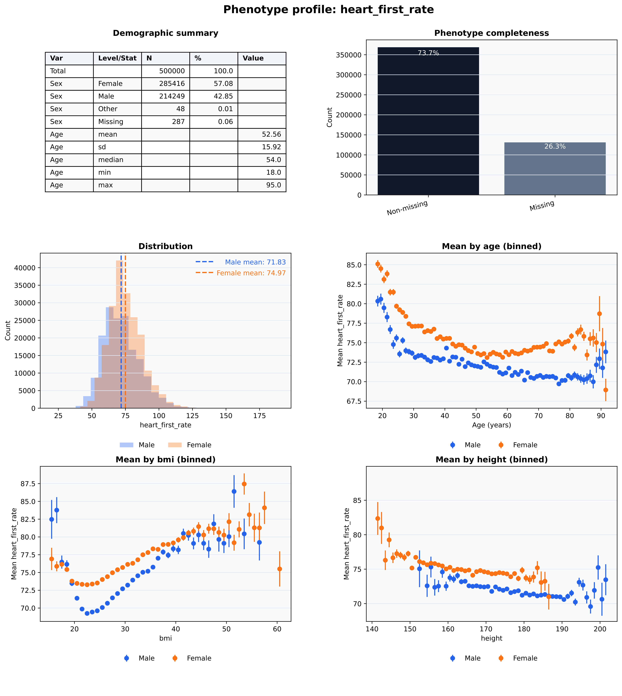

# Phenofhy (beta): The Python package to process pheno data in Our Future Health

Python package for phenotype analysis in the Our Future Health (OFH) trusted
research environment (TRE). Phenofhy is designed to make extraction, processing,
and reporting of OFH phenotype data quick and repeatable inside DNAnexus. It is user-friendly, efficient and easy to install. Built for the OFH DNAnexus trusted research environment.


## Why Phenofhy

- Purpose-built for the OFH TRE and DNAnexus tooling.
- Easily extract and preprocess phenotype data in a few lines of intuitive code.
- Quick summaries and basic phenotype profile reporting to validate data early.

## Target users

- Researchers and students wanting to get started with analysing OFH phenotypes.
- Teams working inside the OFH TRE who need a repeatable preprocessing workflow.
- Analysts creating quick QA summaries and phenotype profile reports before GWAS.

## Environment

Phenofhy is designed to run inside the OFH TRE with DNAnexus tooling and
JupyterLab. It can be used on simulated data outside the TRE for local testing,
but the main workflows assume access to OFH datasets and the `dx` toolkit.

## Installation (TRE)

Phenofhy is currently a beta package for the OFH TRE. There is no automated
installer yet.

1. Download a zip of the repository from GitHub:
   https://github.com/studiovincentstraub/Phenofhy
2. Upload the `Phenofhy/` folder into the TRE using the Airlock process.
   Guidance: https://dnanexus.gitbook.io/ofh/airlock/importing-files-into-a-restricted-project
3. Copy `beta/Phenofhy/config.json` into `/mnt/project/helpers/config.json` and
   update the IDs for your study (project IDs, cohorts, codings, dictionaries).

Tip: when you upload the package, avoid nesting `Phenofhy` inside another
`Phenofhy` folder. The TRE should contain a single `Phenofhy/` directory that
includes the beta modules, which can be optionally nested inside a `applets/` folder.

## Documentation

Explore the full Phenofhy documentation here: https://studiovincentstraub.github.io/Phenofhy/

Where to start on the documentation website?

- New to Phenofhy or OFH phenotype analysis? Begin with "About" and then the
	"Quickstart" for a smooth introduction.
- Got your own data? After "About" and "Quickstart", you are ready to dive in
	and start analyzing.
- Looking for more? Check out the example workflows and API reference to deepen
	your understanding.

## Example workflow

```python
from phenofhy import extract, process, calculate, profile, utils

# 1) Extract a small set of fields
extract.fields(
    output_file="outputs/raw/phenos.csv",
    fields=[
        "participant.registration_year",
        "participant.registration_month",
        "participant.birth_year",
        "participant.birth_month",
        "participant.demog_sex_2_1",
        "questionnaire.smoke_status_2_1",
    ],
)

# 2) Process participant data (derives age, sex, age_group)
df = process.participant_fields("outputs/raw/phenos.csv")

# 3) Summaries
summary = calculate.summary(
    df,
    traits=["derived.age_at_registration", "derived.sex"],
    stratify="derived.sex",
)

# 4) Profile report
report = profile.phenotype_profile(
    df,
    phenotype="derived.age_at_registration",
    output="outputs/reports/age_profile.pdf",
)

# 5) Upload your results
report = utils.upload_files(
   files="outputs/reports/age_profile.pdf",
   dx_target="results"
)
```

## Example output

Below is a phenotype profile report (using simulated data). 



## Contributing

Phenofhy is an internal beta and is evolving quickly. If you find a bug or want
to suggest an improvement, open an issue or start a discussion in the
repository. 

